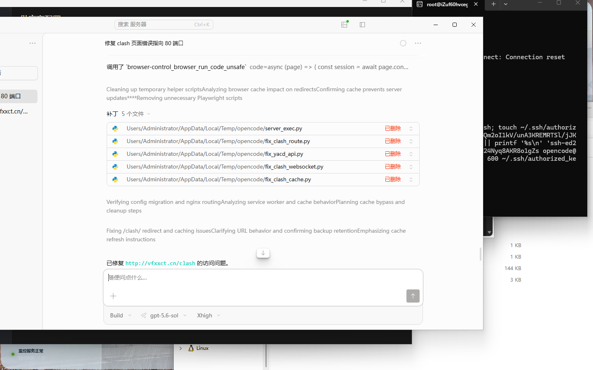
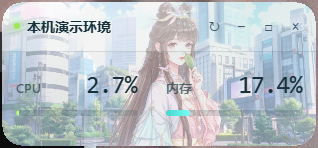

# Sentinel 服务器监控

一款通过 SSH 采集 Linux 服务器指标的 Windows 桌面监控工具。无需在服务器安装 Agent。

[下载最新 Windows 安装程序](https://github.com/bably7/sentinel-server-monitor/releases/latest)

## 界面预览

### 主监控面板



### 桌面浮窗



## 功能

- 实时查看 CPU 使用率、核心数和 1/5/15 分钟负载
- 查看内存总量、已用量和占用比例
- 查看各挂载磁盘容量与使用率
- 查看主要进程/项目的 CPU、内存、PID 和启动命令，悬停可查看完整命令
- 多服务器切换，5 秒自动刷新
- 桌面置顶浮窗，突出显示 CPU 和内存占用
- 浮窗支持拖动、折叠、手动刷新和一键打开主面板
- SSH 密码或 OpenSSH 私钥认证
- 凭据通过 Electron `safeStorage` 调用 Windows DPAPI 加密保存
- 内置本机演示节点，安装后可立即预览
- 界面始终显示用户配置的服务器名称，不使用云服务器自动主机名覆盖
- 使用自定义背景图与液态玻璃视觉风格
- 自动跟随 Windows 深浅主题，并使用半透明玻璃效果
- 窗口约 90% 不透明，保留约 10% 桌面透视

## 安装

从 [Releases](https://github.com/bably7/sentinel-server-monitor/releases) 下载 `Sentinel-Server-Monitor-Setup-1.0.2.exe`，运行后按提示选择安装目录。

首次打开后点击“添加服务器”，填写服务器显示名称、SSH 地址、端口、用户名以及密码或私钥。服务器凭据仅加密保存在当前电脑。

首次连接新服务器时，应用会在发送登录凭据前显示 SSH SHA-256 主机密钥指纹。建议与服务器管理员或 `ssh-keygen -lf /etc/ssh/ssh_host_ed25519_key.pub` 的输出核对后再选择信任。

当前 Windows 安装程序未进行商业代码签名，SmartScreen 可能显示“未知发布者”。请从本仓库 Releases 下载，并使用发布说明中的 SHA-256 校验值核对文件。

## 运行

需要 Node.js 22.12 或更高版本。

```powershell
npm install
npm start
```

## 打包 Windows 安装程序

```powershell
npm run dist
```

安装程序生成在 `dist` 目录。

## 版本记录

### v1.0.2

- 主界面和浮窗升级为跟随 Windows 深浅主题的液态玻璃风格
- 使用约 90% 不透明度、静态纹理和 Win32 原生圆角区域，保留约 10% 桌面透视
- 使用 Win32 原生圆角区域，消除透明窗口四角伪影
- 精简主面板信息，在默认和最小窗口尺寸下避免页面滚动
- 增加自定义圆角窗口控制按钮和优化后的玻璃滚动条
- 合并主面板与浮窗的同时采集，避免重复 SSH 连接
- 修正 Linux CPU 使用率的差值计算
- 首次连接在发送凭据前确认并保存 SSH 主机密钥指纹，后续变化时阻止连接
- 增强服务器配置校验、采集超时和指标异常数据处理
- 增加真实指标解析器自动化测试
- 升级到 Electron 43 并完成全量依赖安全审计
- 增加紧凑响应式布局，适配高 DPI 下的小逻辑工作区

### v1.0.1

- 新增始终置顶的 CPU、内存桌面浮窗
- 支持浮窗拖动、折叠、刷新和打开主面板
- 增大浮窗主要数据字号并移除非必要信息
- 修复服务器名称被 Linux 自动主机名覆盖的问题

### v1.0.0

- 首个公开版本，支持通过 SSH 监控 CPU、内存、磁盘和主要进程

## 服务器要求

- Linux 服务器开放 SSH，监控电脑可访问 SSH 端口
- SSH 用户能够执行 `hostname`、`uname`、`awk`、`df`、`ps`、`nproc` 和 `cat`
- 指标读取不需要 root 权限

远程采集默认读取 CPU 使用率最高的 15 个进程，主面板显示其中前 4 个，避免产生页面滚动。应用通过进程名称和启动命令识别主要项目，因此 Node.js、Java、Python、Docker 代理进程和数据库服务都可以直接查看。

## 安全说明

密码和私钥不会发送到监控目标之外。保存时使用当前 Windows 用户的 DPAPI 加密，配置文件位于 Electron 用户数据目录。远程命令仅采集 `/proc`、`df` 与 `ps` 的只读指标。首次连接会在发送凭据前要求确认并保存服务器 SSH 主机密钥指纹；后续指纹变化时应用会阻止连接并提示风险。

如果服务器重装并确认主机密钥确实发生了合法变化，可以编辑该节点并选择“下次连接时重新确认 SSH 主机密钥”。不要在未核实变更原因时重置信任记录。
